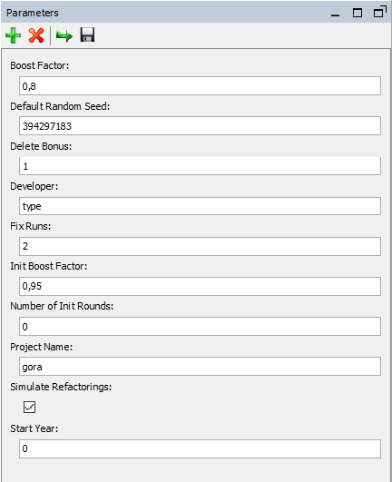

# SimSE - Simulation of Software Evolution
Agent-based simulation model to simulate software evolution. Repast Simphony is used for the implementation. A detailed description of the model, the parameters and their extraction can be found in \[1\]. A general workflow how all tools work together can be found [here](https://github.com/dhonsel/SimSE/blob/main/docs/workflow.md#workflow).

## Requirements
To build the model or to develop it further [Repast Simphony](https://repast.github.io/) (version 2.7) is required. For the development and execution of the simulation model Java 11 or newer is also required. 

## Parameters
We have different parameter types. On the one hand, we have project parameters originating from mining that cannot be changed at runtime. On the other hand, we have parameters that can be changed at runtime to compare different simulation runs.

### Core parameters
The core parameters to initialize the simulation model are generated for each project by our automated [parameter estimation tool](https://github.com/dhonsel/SimParameter). The basic data for each project are the maximum size of the project, the number and change probabilities of commits, the number of rounds to simulate, and the developers (identities) to instantiate with their role specific data. Furthermore, information about bugs, their fixes, and the categories of a project are available. The code data for each project is contained in a JSON file.

### Change Coupling Graph
The change coupling graph is also generated by our automated parameter estimation tool and is stored using the dot format. The nodes represent the files of the software and the edges with their weights represent how often files are changed together in one commit. To initialize the simulation, the nodes contain additional information like the owner, the creator, all developers who touched the file and how often they touched it, and the package the file belongs to. By default, it is generated for each year. This information is used to start the simulation at a given point in time.

### Runtime Parameters
Repast Simphony allows us to define parameters that can be changed in the running application before each simulation run. The current available parameters are depicted in the following figure.

**Project Name**: The name of the project to simulate. According to the name, the configuration files with mined parameters are read.

**Start Year**: The starting point of the simulation. If the year is set to 0, then the simulation starts with an empty change coupling graph. Otherwise, the simulation is initialized with the change coupling graph of the given year. For this the mined graph is loaded.

**Developer**: This parameter represents the developer type to use for the next simulation run. If developer is set to type, then developers are divided into key, maintainer, major, and minor. If this parameter is set to role, then developers are classified into core and peripheral according to the onion model.

**Number of Init Rounds**: If the mining reveals two different update behaviors, for example, an initial phase with pronounced growth and, afterwards, a phase with significantly less growth, then this parameter represents the duration of the initial phase.

**Initial Boost Factor**: This parameter adjusts the effort that the developers spend in the initial phase.

**Boost Factor**: This parameter adjusts the effort that the developers spend in the second phase.

**Delete Bonus**: If not enough files are deleted by the developers work, deleting files can be rewarded using this parameter.

**Fix Runs**: Due to the fact that the bug creation probabilities are based on ITSs data and the bugfix probabilities of the developers are based on VCSs discrepancies between the number of created and the number of fixed bugs can occur. This parameter adjusts the number of trials a developer tries to fix a bug.

**Simulate Refactorings**: If this parameter is switched on, software refactorings are additionally simulated. This can slow down the runtime. (Please note that this parameter is currently disabled and refactorings are not simulated.)

**Default Random Seed**: Default parameter of Repast Simphony used for random number generation.

## Run the simulation

There are two ways to run the simulation. One is to compile the code using Repast Simphony and run it, and the other is to simply install the model of the current release.

For a selection of open source projects we have delivered simulation parameters. The runtime parameters can be found in the folder `SimSE.rs` and are named `parameters_projectname.xml` for each project. Before the simulation is started, the parameters of the project to be simulated must be copied into the file `parameters.xml` which is read in by the simulation at the start-up.

The core parameters and the change coupling graph for the mined projects are stored in the folder `input`. The project specific parts of the file names of these files correspond to the parameter **Project Name** in the file `parameters.xml`.

After a complete simulation run, the simulation data is saved in the `output` folder.

## References
\[1\] Development of Agent-Based Simulation Models for Software Evolution, Daniel Honsel, 2020, http://hdl.handle.net/21.11130/00-1735-0000-0005-1318-B